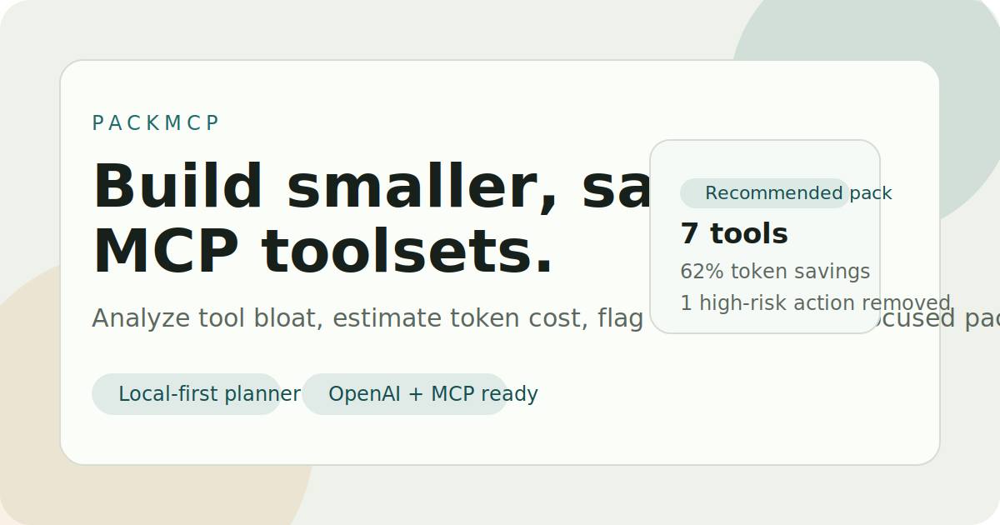

# PackMCP




PackMCP helps you build smaller, safer MCP toolsets for real tasks.

Instead of handing every tool to the agent, PackMCP lets you:

- inspect a `tools/list` manifest or raw tool array
- estimate how much tool metadata costs in context tokens
- spot risky write, merge, deploy, or dispatch tools early
- score tools against a concrete task and pack profile
- export a tighter allowlist for Python and TypeScript runtimes
- run the same analysis from the CLI for scripts and CI
- compare two MCP manifests before migration or rollout

## Why this matters

As of `2026-03-20`, MCP is already broad enough that the problem is no longer just connection setup. The more common problem is tool overload:

- too many tools in the prompt
- too many side-effecting actions exposed by default
- too little clarity about what the agent actually needs

PackMCP is built for that layer.

## What the current version does

- local-first static UI
- task-aware tool scoring
- risk classification and warning cards
- recommended pack generation by profile and risk budget
- copyable exports for allowlists and SDK filters
- optional multi-manifest comparison mode
- sample manifest and testable core logic

## Quickstart

```bash
npm start
```

Then open `http://localhost:4174`.

You can also run the tests:

```bash
npm test
```

You can run a CLI analysis too:

```bash
npm run analyze:sample
```

And compare two manifests:

```bash
npm run compare:sample
```

## Project structure

- `index.html` app shell
- `styles.css` visual design
- `src/app.js` browser UI controller
- `src/core.js` scoring, recommendation, export logic
- `src/data.js` presets and sample data
- `examples/github-mcp-server.sample.json` example input
- `test/core.test.mjs` regression tests
- `scripts/serve.mjs` zero-dependency dev server
- `bin/packmcp.mjs` CLI entrypoint

## Example use cases

- Give a coding agent read-only GitHub tools for issue triage.
- Trim a huge MCP server down before wiring it into OpenAI Agents or Claude.
- Review a vendor MCP manifest and surface high-risk tools before rollout.
- Compare how much schema/token cost you save by curating a smaller pack.
- Generate a structured JSON report in CI before approving an MCP server rollout.
- Compare two MCP servers or two versions of the same server before migration.

## Design principles

- local-first by default
- no framework lock-in
- explain the recommendation, not just the output
- keep the core logic pure and testable
- export artifacts that are easy to paste into real runtimes
- work both as a browser product and a command-line utility

## Current boundaries

- no live MCP transport or proxy yet
- no schema compression beyond lightweight heuristics
- no client-specific config generators beyond simple snippets
- no side-by-side server comparison yet

## CLI example

```bash
packmcp analyze \
  --input ./examples/github-mcp-server.sample.json \
  --preset review \
  --profile balanced \
  --risk medium \
  --format json
```

Write the output to a file:

```bash
packmcp analyze \
  --input ./examples/github-mcp-server.sample.json \
  --preset coding \
  --profile coding \
  --risk medium \
  --format json \
  --output ./packmcp-report.json
```

Compare two manifests:

```bash
packmcp compare \
  --left ./examples/github-mcp-server.sample.json \
  --right ./examples/browser-ops.sample.json \
  --preset coding \
  --profile coding \
  --risk medium \
  --format json
```

## Next upgrades

- ingest MCP Inspector exports directly
- add runtime proxy mode for enforcement
- compare multiple manifests side by side with diff history
- improve token estimation using schema-aware compression rules
- generate client-specific configs for more runtimes
